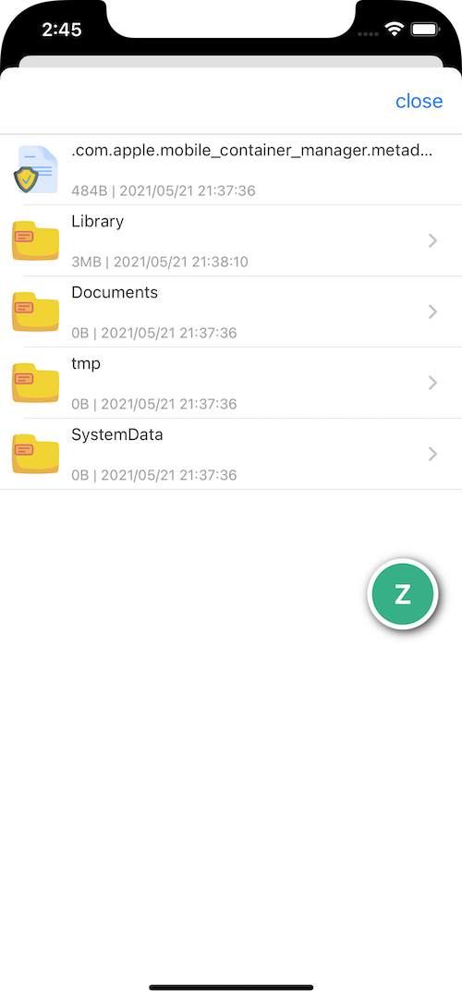
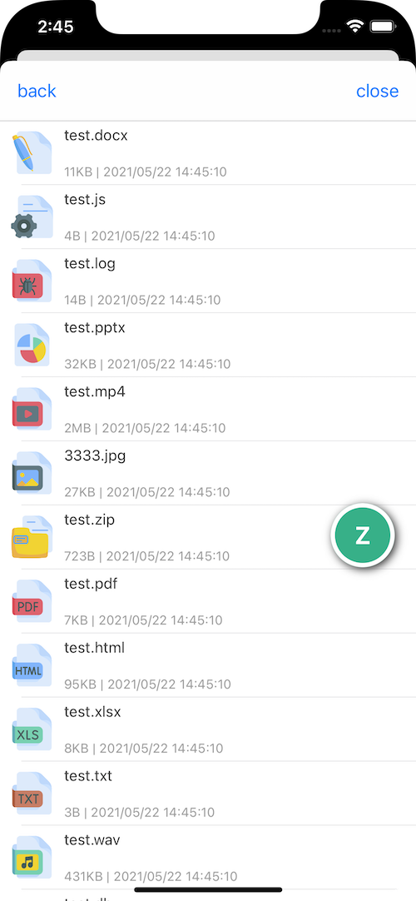
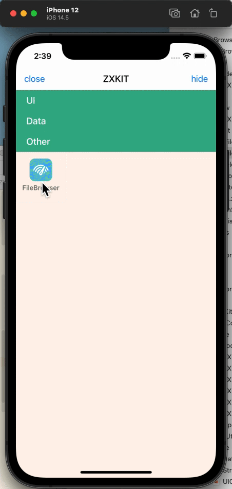

# DDFileBrowser

   

[中文文档](https://dongge.org/blog/1295.html)

The iOS sandbox file browser can view, copy, move, delete files and other operations. Use `quick look` framework to preview and long press to display more operations.

## Independent integration

cocoapods

```ruby
pod 'DDFileBrowser'
```

### Use

```swift
DDFileBrowser.shared.start()
```

you can get the file type of the specified path by this function

```swift
DDFileBrowser.shared.getFileType(filePath: path)
```

If you want to control VC navigation yourself, you can use `DDFileBrowserVC`.

## Preview

|File List|File Type Icon|
|----|----|
|||

Function example



## License

The project is based on the MIT License
