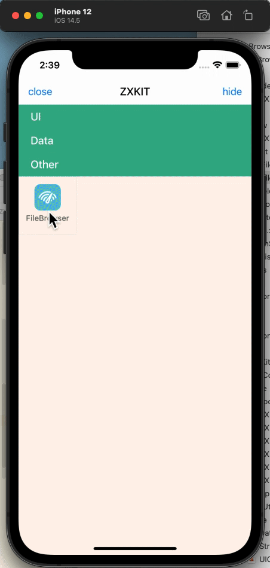

# ZXFileBrowser

[中文文档](./README_zh.md)


The iOS sandbox file browser can view, copy, move, delete files and other operations.

This project is a built-in function plug-in of [ZXKitSwift](https://github.com/ZXKitCode/ZXKitSwift), and it can also be integrated separately and used as an independent function.

**If you have integrated `ZXKitSwift`, the file browser will be automatically displayed in the plug-in list, so there is no need to repeat the integration.**


## Independent integration

cocoapods

```ruby
pod 'ZXFileBrowser'
```

### Use

```swift
ZXFileBrowser.shared.start()
```

## Support `ZXKit`

**If you have integrated `ZXKitSwift`, the file browser will be automatically displayed in the plug-in list, so there is no need to repeat the integration.**

If you need to support `ZXKit`, you can use cocoapods to quickly integrate it

```ruby
pod 'ZXFileBrowser/zxkit'
```

then register to `ZXKit` in `AppDelegate`

```swift
func application(_ application: UIApplication, didFinishLaunchingWithOptions launchOptions: [UIApplication.LaunchOptionsKey: Any]?) -> Bool {
	
	ZXKit.regist(plugin: ZXFileBrowser.shared)
	
	return true
}
```

## Preview




## License


Base on Apache-2.0 License
